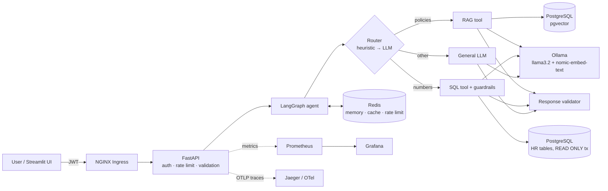
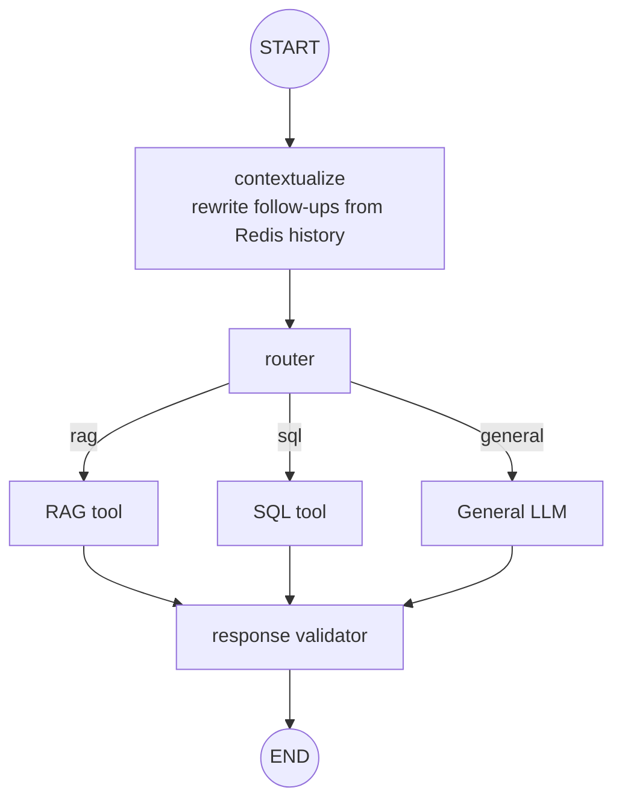
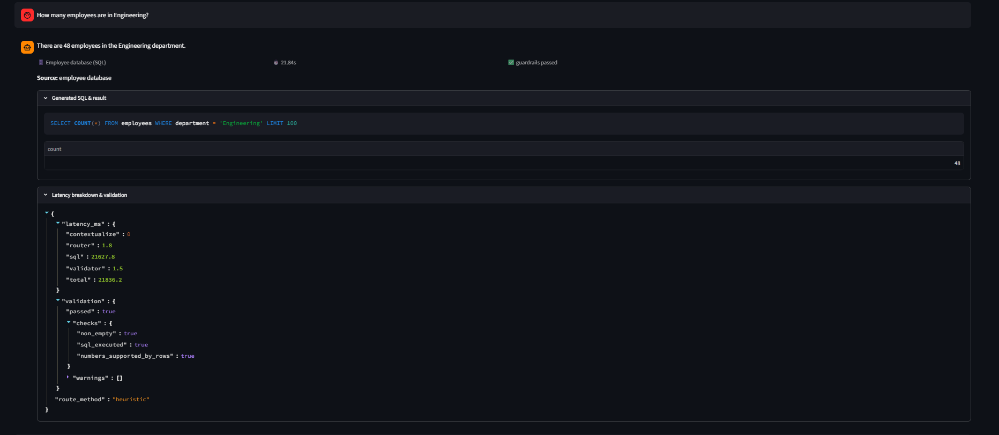
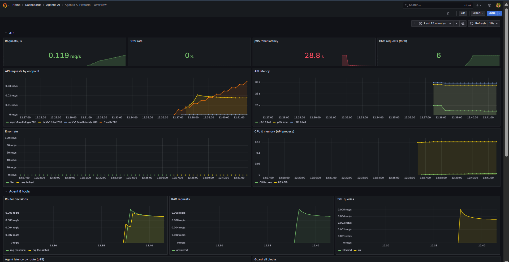
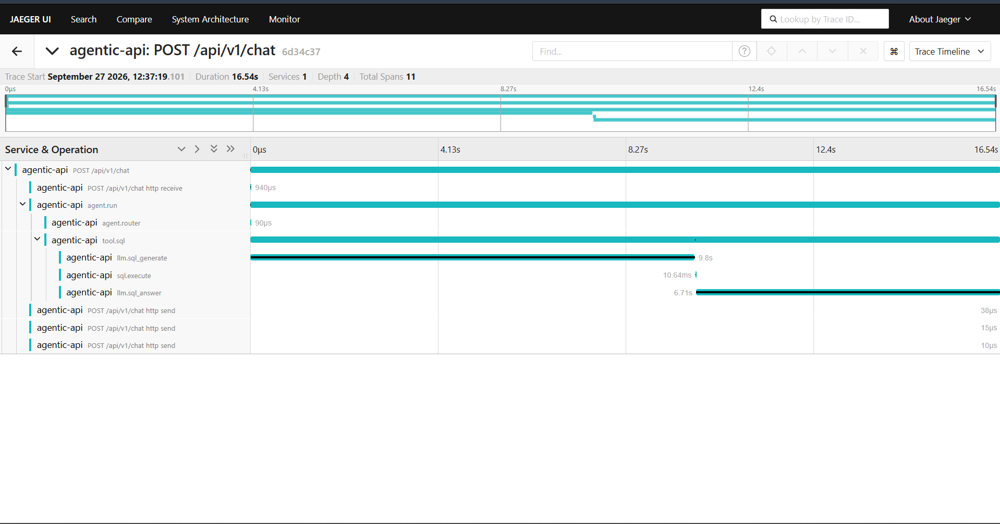
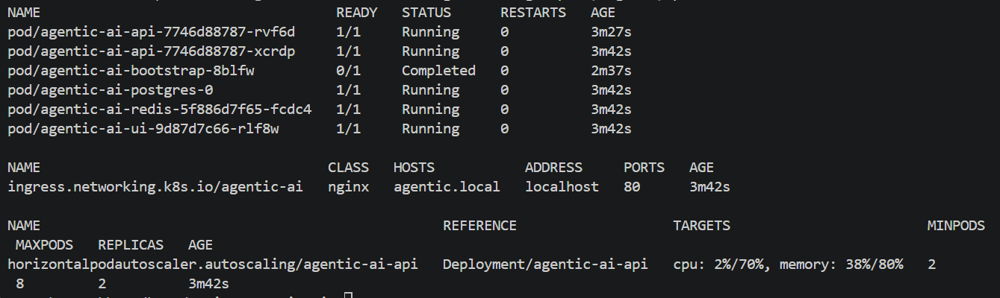
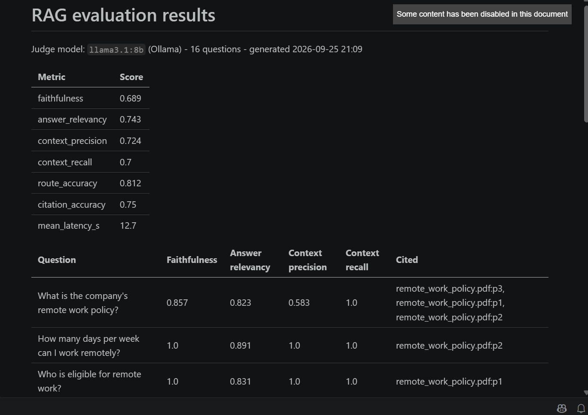

# Production-Oriented Agentic AI Platform

An AI knowledge and analytics assistant that answers questions over two very different kinds of company data: unstructured policy documents (via RAG over pgvector) and a structured HR database (via guarded text-to-SQL). A LangGraph agent decides which tool each question needs, remembers the conversation in Redis, checks its own answers before returning them, and sits behind a JWT-secured FastAPI service that is instrumented, evaluated in CI, containerised, and deployable to Kubernetes with an AWS-ready Terraform layer.

Everything runs locally for $0. The LLM and embeddings come from [Ollama](https://ollama.com); the AWS infrastructure is written, validated and planned with mock credentials, but never applied unless you choose to.

> The company in the sample data, **Helix Dynamics**, is fictional. The five policy PDFs in `data/documents/` and the 137 employee records are synthetic and generated deterministically, so every environment returns the same answers.

---

## The problem

Most "chat with your docs" demos stop at a single retrieval chain with an open endpoint. Real internal assistants have to route between knowledge sources, refuse unsafe actions, cite where an answer came from, be measurable when someone changes a prompt or an embedding model, and survive being deployed. This project is built around those concerns rather than around the chatbot.

| Question | What the agent does |
|---|---|
| *What is the company's remote work policy?* | Routes to **RAG**, retrieves policy chunks from pgvector, answers with page-level citations |
| *How many employees are in Engineering?* | Routes to **SQL**, generates a `SELECT`, validates it, runs it read-only, explains the result |
| *What about Finance?* (follow-up) | Rewrites to *How many employees are in Finance?* using Redis conversation memory, then SQL |
| *Compare Engineering and Finance headcount.* | SQL with `GROUP BY`, then a natural-language comparison |
| *What is the vacation policy for employees with more than 5 years of experience?* | RAG (policy language wins over "employees/experience") |
| *Delete all employees* | Blocked before any LLM call: **"Only read-only SQL operations are supported."** |

---

## Architecture



The agent graph itself (`app/agents/graph.py`):



More detail, including the AWS target architecture, is in [docs/architecture.md](docs/architecture.md).

---

## What's inside

- ✓ **Agentic AI** – LangGraph state graph with a hybrid router (keyword scorer for obvious cases, LLM only for ambiguous ones)
- ✓ **RAG** – PDF/Markdown/Text ingestion → cleaning → per-page chunking → nomic embeddings → pgvector HNSW index, with page-level citations
- ✓ **SQL agent** – schema-aware text-to-SQL with AST-level guardrails (sqlglot), allow-listed tables/columns, enforced `LIMIT`, `READ ONLY` transaction and statement timeout
- ✓ **Tool calling** – RAG, SQL and general LLM as graph nodes with typed state
- ✓ **JWT authentication** – login, bearer tokens, admin role for document management, `alg` pinned, issuer/expiry required
- ✓ **Redis** – per-user conversation memory, answer cache (invalidated on ingestion), per-user rate limiting; degrades gracefully if Redis is down
- ✓ **Guardrails** – write-intent detection, SQL AST validation, grounded-answer check, numeric hallucination check against sources/rows
- ✓ **Evaluation** – retrieval hit-rate/MRR gate, text-to-SQL execution accuracy, Ragas faithfulness/relevancy/context metrics with a local judge
- ✓ **Docker** – multi-stage, non-root image; Compose stack with Postgres, Redis, API, UI, Prometheus, Grafana, Jaeger, optional Ollama
- ✓ **Kubernetes** – Deployment, Service, ConfigMap, Secret, NGINX Ingress, HPA, PDB, NetworkPolicies, bootstrap Job
- ✓ **Helm** – one chart, local values and an EKS overlay (ECR, IRSA, External Secrets, ALB, managed data services)
- ✓ **Terraform** – VPC, EKS, ECR, S3, RDS, ElastiCache, Secrets Manager, IAM/IRSA, GitHub OIDC; plans with mock credentials
- ✓ **Prometheus + Grafana** – HTTP, agent, LLM, retrieval, SQL, cache and guardrail metrics; a 17-panel provisioned dashboard; alert rules
- ✓ **OpenTelemetry** – spans for every request, graph node, LLM call, retrieval and SQL execution; trace ids in JSON logs
- ✓ **GitHub Actions** – lint, unit, integration (real pgvector/Redis), retrieval gate, weekly LLM eval, Docker build + Trivy scan, Terraform/Helm/K8s validation
- ✓ **AWS-ready** – ECR push via OIDC (no stored keys) is wired but only runs when you set `AWS_ROLE_ARN`

---

## Quickstart

### Option A: five-minute offline demo (no Ollama)

This uses a deterministic stand-in LLM and hash embeddings so you can see the whole platform working before downloading any models. Answers are extractive and SQL generation only handles a few patterns; it exists to exercise the plumbing, not to be smart.

```bash
cp .env.example .env
# in .env set: LLM_PROVIDER=fake, EMBEDDING_PROVIDER=hash, RETRIEVAL_MIN_SCORE=0.1, and real secrets
docker compose up -d --build
open http://localhost:8501          # UI  (admin / the ADMIN_PASSWORD you set)
open http://localhost:8000/docs     # API
```

### Option B: the real thing with a local LLM

```bash
# 1. Install Ollama natively (uses Apple Silicon / NVIDIA GPUs) and pull the models
ollama pull llama3.2:3b          # or llama3.1:8b / qwen2.5:7b if you have 16 GB+ RAM
ollama pull nomic-embed-text

# 2. Configure and start
cp .env.example .env              # set JWT_SECRET, ADMIN_PASSWORD, POSTGRES_PASSWORD, GRAFANA_ADMIN_PASSWORD
docker compose up -d --build      # API reaches Ollama at host.docker.internal:11434

# Prefer Ollama in a container (Linux/NVIDIA)?  docker compose --profile ollama up -d --build
```

| Service | URL |
|---|---|
| Streamlit UI | http://localhost:8501 |
| API + Swagger | http://localhost:8000/docs |
| Grafana | http://localhost:3000 (dashboard: *Agentic AI → Overview*) |
| Prometheus | http://localhost:9090 |
| Jaeger (traces) | http://localhost:16686 |

On first start the API applies the schema, seeds the HR tables and the admin user, and ingests the PDFs (skipped on later starts thanks to checksums).

### Option C: Kubernetes (kind + Helm)

```bash
make k8s-up        # kind cluster → NGINX Ingress → metrics-server → build/load images → helm install
# add "127.0.0.1 agentic.local" to /etc/hosts
open http://agentic.local
kubectl -n agentic-ai get hpa -w     # watch autoscaling while running `make load-test`
```

Raw manifests are also available (`kubectl apply -k k8s/`) if you want to see Kubernetes without Helm.

### Option D: AWS infrastructure plan ($0)

```bash
make tf-plan       # fmt → init → validate → plan with mock_aws=true. Nothing is created.
```

Set `mock_aws = false`, add real credentials and a remote state backend only if you actually want to deploy. See the cost note in [docs/architecture.md](docs/architecture.md#aws-cost-note).

---

## Using the API

```bash
TOKEN=$(curl -s -X POST localhost:8000/api/v1/auth/login \
  -H 'content-type: application/json' -d '{"username":"admin","password":"<ADMIN_PASSWORD>"}' | jq -r .access_token)

curl -s -X POST localhost:8000/api/v1/chat -H "Authorization: Bearer $TOKEN" \
  -H 'content-type: application/json' \
  -d '{"question":"How many employees are in Engineering?","session_id":"demo-1"}' | jq
```

The response carries everything needed to trust (or debug) the answer: `route`, `route_method`, `standalone_question`, `sources` (file + page + score + chunk text, or the SQL), `sql`, `rows`, `validation` (each guardrail check), and `latency_ms` broken down per graph node.

| Endpoint | Auth | Purpose |
|---|---|---|
| `POST /api/v1/auth/login` | – | Credentials → JWT |
| `GET /api/v1/auth/me` | user | Current user |
| `POST /api/v1/chat` | user, rate-limited | Ask the agent |
| `GET /api/v1/chat/{session_id}/history` | user | Conversation (scoped to the caller) |
| `DELETE /api/v1/chat/{session_id}` | user | Clear conversation |
| `POST /api/v1/documents` | admin | Upload + ingest a PDF/MD/TXT (10 MB max) |
| `GET /api/v1/documents` | user | List ingested documents |
| `DELETE /api/v1/documents/{filename}` | admin | Remove a document and its chunks |
| `GET /api/v1/health`, `/health/ready` | – | Liveness / readiness |
| `GET /api/v1/metrics` | – | Prometheus metrics |

---

## How the pieces work

**Routing.** Most questions are obvious from their wording, so a weighted keyword scorer handles them in microseconds and only ambiguous questions pay for an LLM routing call. Every decision is counted in `agent_route_total{route, method}`, which tells you how often the expensive path is taken.

**Memory.** Conversation turns live in Redis under `chat:{user}:{session}`, capped and TTL'd, so one user can never read another's session. Follow-ups are rewritten into standalone questions before routing; the common "what about &lt;department&gt;?" shape is handled deterministically, anything else goes to the LLM.

**SQL guardrails.** The question is checked for write intent before any LLM call. The generated SQL is then parsed into an AST: exactly one statement, a `SELECT`/CTE/UNION only, no DML/DDL nodes anywhere in the tree (which catches `SELECT ... INTO` and data-modifying CTEs that keyword filters miss), allow-listed tables and columns only, no dangerous functions (`pg_sleep`, `pg_read_file`, `dblink` and friends), and a `LIMIT` injected or clamped. Execution happens inside `SET TRANSACTION READ ONLY` with a statement timeout, so even a validator bug cannot write. An integration test proves that last layer independently.

**Response guardrails.** RAG answers must be backed by retrieved chunks above a similarity threshold or they are replaced with "I don't know based on the provided documents." Numbers in an answer that don't appear in the cited chunks (or SQL rows) are flagged and the answer carries a visible caveat. Every check is returned in `validation`.

**Caching.** First-turn answers are cached by normalised question; follow-ups never are, because their meaning depends on the conversation. Uploading or deleting a document invalidates the cache.

---

## Evaluation

Evaluation runs at three levels, each with a different cost and cadence.

| Layer | What it measures | Needs an LLM? | When it runs |
|---|---|---|---|
| Retrieval gate (`app/evaluation/retrieval.py`) | hit-rate@k, hit@1, page recall, MRR over 16 labelled questions | No | Every PR, fails below threshold |
| SQL execution accuracy (`app/evaluation/sql_eval.py`) | Generated query returns the same values as a hand-written gold query (10 questions) | Yes | Weekly / on demand |
| Ragas (`app/evaluation/ragas_eval.py`) | Faithfulness, answer relevancy, context precision, context recall, plus route and citation accuracy | Yes (local judge) | Weekly / on demand |

Ragas runs black-box against the live API over HTTP and in its own virtualenv (`requirements-eval.txt`), because ragas 0.4.x still imports modules that langchain-community 0.4 removed.

### Results

Measured locally on a Windows laptop (CPU inference via Ollama). Answering model `llama3.2:3b`, embeddings `nomic-embed-text`, Ragas judge `llama3.1:8b`.

**Retrieval** (16 labelled questions, top-4, pgvector HNSW)

| Metric | Hash-embedding baseline | nomic-embed-text |
|---|---|---|
| Hit-rate@4 (right document in top 4) | 0.938 | **1.000** |
| Page recall@4 (right document and page) | 0.938 | **1.000** |
| Hit@1 (right document ranked first) | 0.938 | **0.938** |
| MRR | 0.938 | **0.958** |

**Text-to-SQL** (10 questions, execution accuracy against hand-written gold queries): **70%** with `llama3.2:3b`. The three misses were model errors, not guardrail or execution problems: extra unrequested columns on a comparison, a missing `department` column on a per-department average, and filtering `role` instead of `department` for "Data Science".

**End-to-end RAG** (Ragas, 16 questions, black-box through the API)

| Metric | Score |
|---|---|
| Faithfulness | 0.689 |
| Answer relevancy | 0.743 |
| Context precision | 0.724 |
| Context recall | 0.700 |
| Route accuracy (question sent to the RAG tool) | 0.812 |
| Citation accuracy (expected page cited) | 0.750 |
| Mean latency per question | 12.7 s |

Semantic embeddings fixed the baseline's only miss ("daily meal allowance", which shares no keywords with "meals ... up to 75 US dollars per day"). The remaining retrieval miss, "Is there a home office stipend?", ranks the benefits policy's *wellness* stipend first while the correct handbook page is third with a near-identical score. Route accuracy below 1.0 is a router issue: "What is the annual learning and development budget?" is pulled to SQL by the word *budget*, and three policy questions with no strong keywords (performance reviews, meal allowance, incident reporting) fall through to the LLM router, where the 3B model misroutes some of them. Richer policy keywords and a larger routing model are the clearest next improvements, along with a larger model for SQL generation.

---

## Observability

The API exports Prometheus metrics for HTTP traffic (`http_requests_total`, `http_request_duration_seconds`, in-flight, 5xx), the agent (`agent_route_total`, `agent_duration_seconds`, `guardrail_blocks_total`), the LLM (`llm_requests_total`, `llm_request_duration_seconds` per task), retrieval quality (`rag_top_score` histogram, useful as a drift signal), SQL (`sql_queries_total`, `sql_query_duration_seconds`), cache hits and rate-limit rejections. Route labels use the route template, so `/chat/{session_id}/history` doesn't explode label cardinality.

Grafana is provisioned with the Prometheus and Jaeger data sources and a 17-panel dashboard (`monitoring/grafana/dashboards/agentic-ai.json`). Prometheus loads six alert rules: API down, error rate above 5%, p95 chat latency above 20 s, LLM errors, a drop in median retrieval score, and a spike in guardrail blocks.

With `OTEL_ENABLED=true` every request produces a trace like this one, captured from this build with the fake LLM, so the LLM spans are tiny; with Ollama they dominate:

```
POST /api/v1/chat              10.45 ms
└─ agent.run                    5.37 ms
   ├─ agent.contextualize       0.03 ms
   ├─ agent.router              0.16 ms
   └─ tool.sql                  3.00 ms
      ├─ llm.sql_generate       0.39 ms
      ├─ sql.execute            1.04 ms
      └─ llm.sql_answer         0.31 ms
```

LangSmith is optional: set `LANGSMITH_TRACING=true` and `LANGSMITH_API_KEY` and LangChain/LangGraph calls are traced there as well. Nothing depends on it.

---

## Load testing

`make load-test` runs Locust at 10, 50 and 100 users. The numbers below were measured in the build environment with the **fake LLM**, a single uvicorn worker, local Postgres and Redis. They show platform overhead (auth, routing, retrieval, SQL, Redis, serialisation), not model speed, and most RAG requests were answer-cache hits:

| Users | Requests | Failures | Throughput | p50 | p95 | p99 |
|---|---|---|---|---|---|---|
| 10 | 250 | 0 | 5.7 req/s | 9 ms | 160 ms | 180 ms |
| 50 | 1,212 | 0 | 27.5 req/s | 10 ms | 83 ms | 160 ms |
| 100 | 2,387 | 0 | 54.2 req/s | 13 ms | 190 ms | 320 ms |

With Ollama the bottleneck moves to generation, which is serial per model on a laptop, so expect seconds per uncached question. That is also why the HPA scales API pods on CPU/memory while the LLM would scale separately (GPU node group or a managed endpoint) in a real deployment.

---

## Security

Passwords are hashed (PBKDF2-SHA256 via passlib) and login does a dummy hash for unknown users so timing doesn't reveal valid usernames. JWTs pin the algorithm (so `alg: none` and key-confusion tokens are rejected), require `exp`/`iat`/`sub` and check the issuer. Document upload and deletion need the admin role; filenames are stripped of client paths and file type and size are checked. Every chat request is rate-limited per user in Redis, and NGINX Ingress adds a per-IP limit at the edge. Secrets never live in the repo: `.env` is git-ignored, Kubernetes reads a Secret created out-of-band, and on AWS the External Secrets Operator syncs them from Secrets Manager through IRSA. Containers run as UID 10001 with a read-only root filesystem, all capabilities dropped and `seccomp: RuntimeDefault`; NetworkPolicies allow the data tier to be reached only from the API and the bootstrap Job. CI pushes to ECR through GitHub OIDC, so no long-lived AWS keys exist anywhere.

---

## CI/CD

| Workflow | Jobs |
|---|---|
| `tests.yml` | ruff lint + format → unit tests and evaluation gates → integration tests against pgvector and Redis service containers |
| `evaluation.yml` | retrieval gate on every PR; weekly/manual job installs Ollama on the runner, starts the API and runs SQL accuracy + Ragas, publishing the results table to the job summary |
| `docker.yml` | build API and UI images (buildx + GHA cache) → container smoke test incl. non-root check → Trivy scan → push to ECR via OIDC only if `AWS_ROLE_ARN` is configured |
| `infra.yml` | `terraform fmt/validate/plan` with mock credentials, `helm lint`, kubeconform on raw manifests and on the rendered chart (both value sets, CRDs included), promtool |

---

## Project structure

```
production-agentic-ai/
├── app/
│   ├── main.py               FastAPI app, middleware (metrics, request id), lifespan
│   ├── config.py             pydantic-settings, all config from env
│   ├── api/                  routes (auth, chat, documents, health/metrics), schemas, deps
│   ├── auth/                 password hashing, JWT, user repository
│   ├── agents/               LangGraph graph, hybrid router, prompts, response validator
│   ├── rag/                  ingestion, embeddings, pgvector store, RAG tool
│   ├── sql/                  guardrails (sqlglot AST), read-only executor, SQL tool
│   ├── database/             schema.sql, connection pool, seed, bootstrap (advisory-locked)
│   ├── evaluation/           retrieval gate, SQL execution accuracy, Ragas runner
│   ├── services/             DI container, LLM factory, Redis memory/cache/rate limiter
│   └── monitoring/           Prometheus metrics, OpenTelemetry, JSON logging
├── tests/                    unit, API, auth, guardrails, agent, evaluation, integration
├── data/documents/           sample policy PDFs (fictional)      data/eval/  labelled eval sets
├── ui/                       Streamlit front-end
├── scripts/                  ingestion, sample-doc generator, Locust, kind bring-up
├── docker/                   UI Dockerfile, Postgres init, Ollama model pull
├── k8s/                      raw manifests + kustomization
├── helm/agentic-ai/          Helm chart (values.yaml local, values-aws.yaml EKS)
├── terraform/                root module + modules/{vpc,eks,ecr,s3,data,secrets,iam}
├── monitoring/               Prometheus config + alerts, Grafana provisioning + dashboard
├── .github/workflows/        tests, evaluation, docker, infra
├── docs/                     architecture, build guide, verification log
├── Dockerfile  docker-compose.yml  Makefile  requirements*.txt  .env.example
```

---

## Design decisions and trade-offs

**Why a fake LLM and hash embeddings exist.** Tests and PR checks must be fast, deterministic and free. Injecting them through a small DI container means the same graph, guardrails and API code run in tests as in production; only the model backends differ. The retrieval gate therefore measures a keyword baseline on every PR, while semantic quality is measured by the scheduled LLM evaluation.

**Why readiness only depends on Postgres.** If Ollama goes down, the SQL and document endpoints still work and an alert fires. Failing readiness would pull every pod out of the Service and turn a partial outage into a total one.

**Why pgvector instead of a dedicated vector DB.** One database for structured and unstructured data keeps operations simple and lets RDS host both in AWS. HNSW with cosine distance is plenty for this corpus size.

**Why ingestion runs as a Job in Kubernetes.** Multiple API replicas starting at once shouldn't race to migrate and seed. Locally the API bootstraps itself; in the cluster a Helm post-install/upgrade hook does it, and a Postgres advisory lock makes it safe either way.

## Known limitations and next steps

The SQL tool reads two tables and doesn't join across RAG and SQL in one answer yet (a planner node that calls both tools is the natural next step). The fake LLM only handles a handful of SQL shapes. Ingestion is synchronous inside the upload request; a worker queue (the "Worker" box in the AWS diagram) would suit large files. Documents are stored in Postgres only; the S3 bucket in Terraform is where originals would live in AWS.

## Screenshots

**Chat UI**: SQL and RAG answers with sources, guardrail status and latency.



**Grafana**: request rate, error rate, p95 latency, router decisions, RAG/SQL traffic and process resources.



**Jaeger (OpenTelemetry)**: one `/chat` request end to end. Routing takes 90 us and the SQL query 10 ms; the two LLM calls take 9.8 s and 6.7 s of the 16.5 s total on CPU.



**Kubernetes (kind)**: two API replicas behind NGINX Ingress, HPA active, bootstrap Job completed.



**Ragas evaluation**: `llama3.2:3b` answering, `llama3.1:8b` judging, 16 questions.

