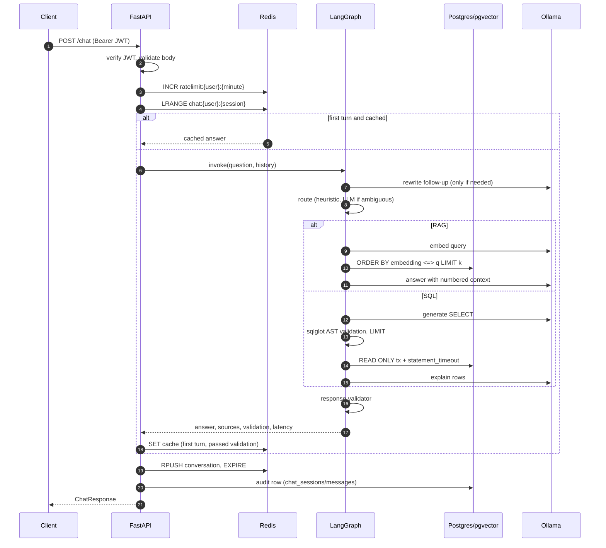
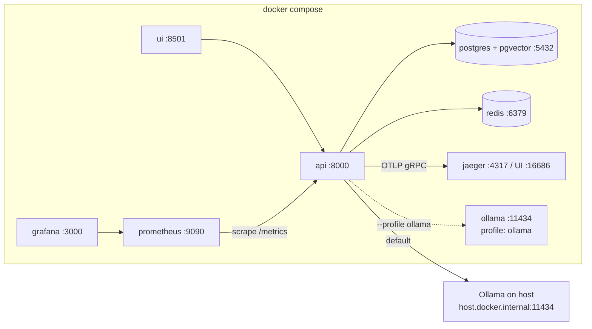
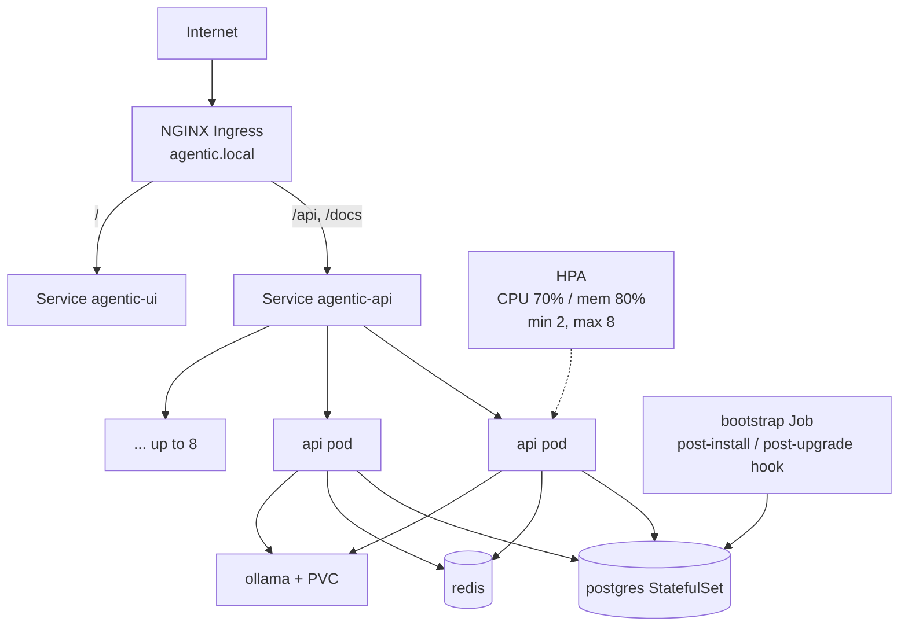
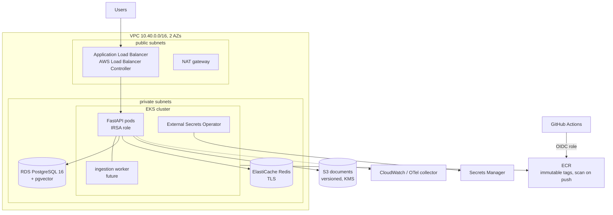

# Architecture

## Request lifecycle

A `/api/v1/chat` request passes through these stages. Each one has a metric and a trace span, so a slow or wrong answer can be pinned to a specific step.

## Data model

| Table | Purpose |
|---|---|
| `users` | Login accounts (PBKDF2 hashes, role) |
| `documents` | One row per ingested file: checksum (idempotent re-ingestion), pages, chunk count |
| `document_chunks` | Chunk text, page number, `vector(768)` embedding, HNSW cosine index |
| `departments`, `employees` | Structured HR data for the SQL tool (the only tables it may read) |
| `chat_sessions`, `messages` | Durable audit trail of conversations (Redis holds the hot copy) |

## Local topology (Docker Compose)

## Kubernetes topology

Pods are spread across nodes with a topology constraint, the rolling update never drops below the current replica count (`maxUnavailable: 0`), a PodDisruptionBudget keeps one pod during node drains, and `preStop` plus a 60 s grace period lets in-flight LLM calls finish. NetworkPolicies default-deny ingress and then allow only Ingress → API/UI, UI → API, monitoring → API, and API/bootstrap → data services.

The HPA scales in steps of two pods per minute (2 → 4 → 6 → 8) and back down one pod every two minutes after a five-minute stabilisation window, which avoids flapping when chat traffic is bursty.

## AWS target architecture

Terraform modules map one-to-one to this picture: `vpc` (subnets tagged for load balancers, single or per-AZ NAT, S3 gateway endpoint, flow logs), `eks` (KMS-encrypted secrets, API auth mode with access entries, IMDSv2-only managed nodes, OIDC provider for IRSA, core add-ons including metrics-server for the HPA), `ecr`, `s3`, `data` (RDS with forced TLS, ElastiCache with in-transit and at-rest encryption, both reachable only from EKS security groups), `secrets` (one JSON secret consumed by External Secrets), and `iam` (least-privilege app role, ESO role, GitHub Actions push role).

The LLM is the part that doesn't map cleanly to the laptop setup. On AWS you would either run Ollama/vLLM on a GPU node group or switch the LLM factory to a managed endpoint such as Bedrock; the rest of the application is unchanged because every model call goes through `app/services/llm.py`.

### AWS cost note

`terraform plan` with `mock_aws=true` costs nothing and creates nothing. If you ever apply it, the always-on pieces are roughly: EKS control plane (about $73/month), one NAT gateway (about $33/month plus data), two t3.large nodes (about $120/month on demand), a db.t4g.micro RDS instance and a cache.t4g.micro ElastiCache node (together a few tens of dollars). Check current AWS pricing before applying, and `terraform destroy` when finished.

## Configuration

Every setting in `app/config.py` is an environment variable. The important ones:

| Variable | Default | Notes |
|---|---|---|
| `LLM_PROVIDER` | `ollama` | `fake` for offline demo/tests |
| `LLM_MODEL` | `llama3.2:3b` | any Ollama chat model |
| `EMBEDDING_PROVIDER` / `EMBEDDING_MODEL` | `ollama` / `nomic-embed-text` | `hash` for tests; dimension must stay 768 unless you change `schema.sql` |
| `RETRIEVAL_TOP_K` / `RETRIEVAL_MIN_SCORE` | 4 / 0.35 | tune with `make eval-retrieval` |
| `SQL_MAX_ROWS` / `SQL_STATEMENT_TIMEOUT_MS` | 100 / 5000 | guardrail limits |
| `RATE_LIMIT_PER_MINUTE` | 30 | per user |
| `AUTO_MIGRATE` / `AUTO_SEED` / `AUTO_INGEST` | true | set false where a Job owns bootstrap |
| `OTEL_ENABLED` / `OTEL_EXPORTER_ENDPOINT` | false / `localhost:4317` | OTLP gRPC |
